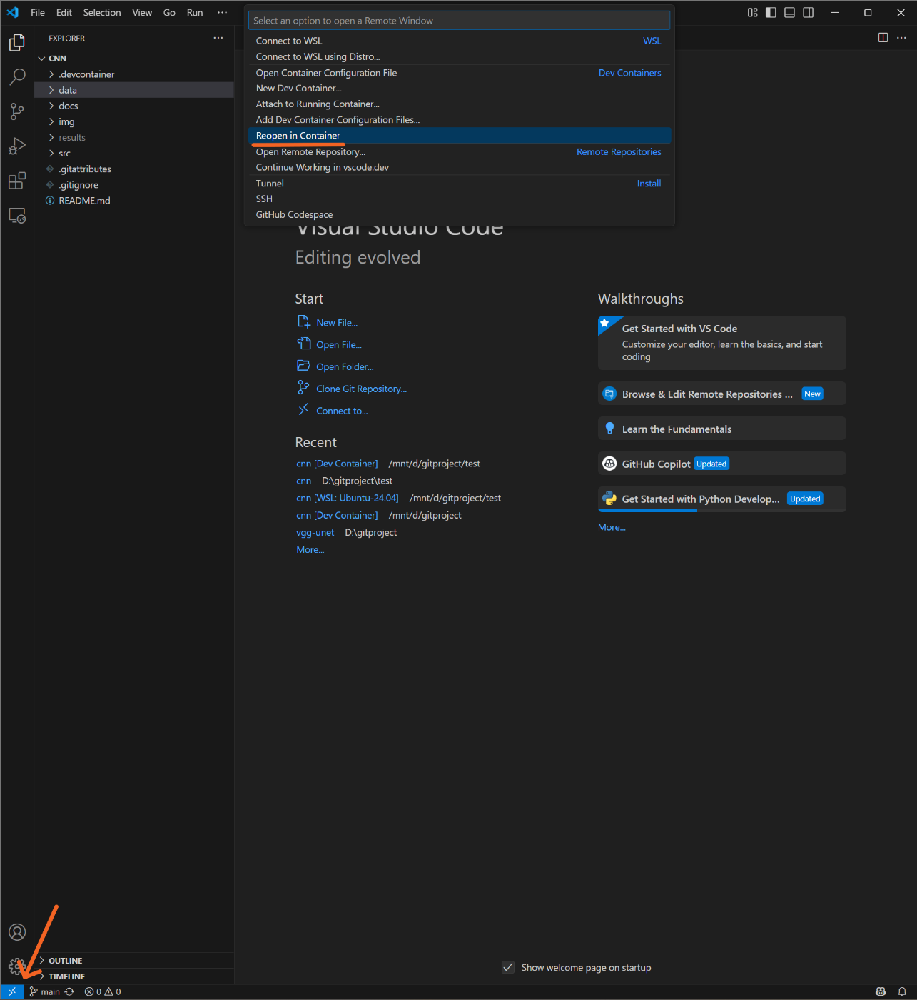

# 必要なパッケージ
- Docker Desktop
- Dev Container (VSCodeの拡張機能)
- Docker (VSCodeの拡張機能)

# Dev Container の実行方法
1. フォルダ構成を以下のようにし、各ファイルに必要な情報を記述する。
    ```
    {project}/
        ├── .devcontainer/
        │   ├── devcontainer.json
        │   ├── Dockerfile
        │   └── requirements.txt
    ```
    - Dockerfileの"name"
    - Dokcerfileのpytorxh url[https://pytorch.org/get-started/locally/](https://pytorch.org/get-started/locally/)

2. 左下の "><" を選択し、その後 "Reopen in Container" を選択。

    
